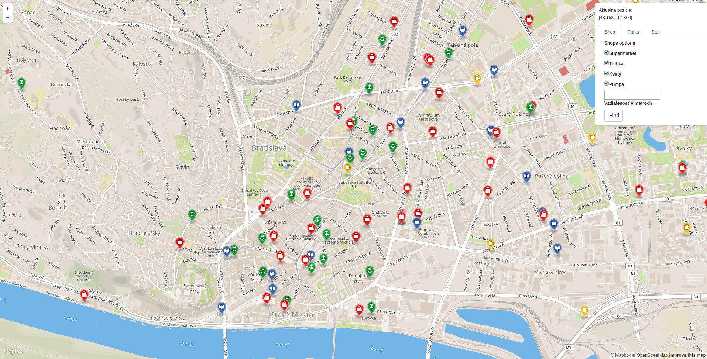

*This is a documentation for a fictional project, just to show you what I expect. Notice a few key properties:*
- *no cover page, really*
- *no copy&pasted assignment text*
- *no code samples*
- *concise, to the point, gets me a quick overview of what was done and how*
- *I don't really care about the document length*
- *I used links where appropriate*

# Overview

This application is trying to help you with your date night with useful information showed on a map. Most important features are:
- search by choice from selection ~~and proximity to my current location~~
- search romantic paths in parks
- search adventure in parks near water-area (river, lake, ...)

This is it in action:

The application has 2 separate parts, the client which is a [frontend web application](#frontend) using mapbox API and mapbox.js and the [backend application](#backend) written in [Python](http://cherrypy.org/), backed by PostGIS. The frontend application communicates with backend using a [REST API](#api).

# Frontend

The frontend application is a static HTML page (`index.html`), which shows a mapbox.js widget. It shows items by query (supermarkets, newsagents, flower shops and gas stations), the park paths and >>stuff<<.

All code is in the folder public separated to css and js part, where relevant frontend code is in folder `js` which is referenced from `index.html`. The frontend code is very simple, its only responsibilities are:
- detecting user's location, using the standard [web location API](https://developer.mozilla.org/en-US/docs/Web/API/Geolocation/Using_geolocation)
- displaying the sidebar panel with options to show, driving the user interaction and calling the appropriate backend APIs
- displaying geo features by overlaying the map with a geojson feature layer, the geojson is provided directly by backend APIs

Also there are fancy addition of markers or colors of finished GeoJSON based on their type.

# Backend

The backend application is written in Python, more exactly using CherryPy framework and is responsible for querying geo data, formatting the geojson and data for the sidebar panel.
The SQL queries are implemented by module psycopg2, which are in REST API functions.

## Data

All data is coming directly from Open Street Maps. I downloaded an extent covering whole Slovakia (around 1.2GB) and imported it using the `osm2pgsql` tool into the standard OSM schema. The application follows standards all queries are placed in separate classes. GeoJSON is generated by using a standard `st_asgeojson` function, however some postprocessing is necessary in order to output from queries be in correct form and  into a single geojson.

## Api

**Find parks by proximity to nearest water**

`GET /api/parks_water/{distance}`

Other GETs are using only a basic definition, because my proximity queries weren't working properly and rather have something than nothing.

There other parts of api are:

`GET /api/supermarkets`
`GET /api/newsagents`
`GET /api/flowers`
`GET /api/gas`
`GET /api/parks`

### Response

API calls return json responses with JSON filled with query returns (default types of GeoJSON: Point, Polygon, ...).
The are then parsed in map.js to be in correct GeoJSON form for Mapbox to accept them.
